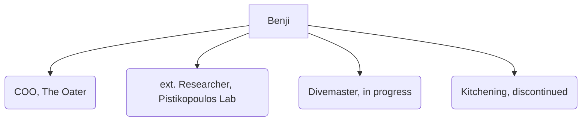

# About me
{: .no_toc }

Hello there! I am Benjamin. If you want to get to know me, please read along.
{: .fs-6 .fw-300 }

## Table of contents
{: .no_toc .text-delta }

1. TOC
{:toc}

---

Interested in discussion? Contact me via [mail](mailto:{{ site.email }}).

## Who is that guy?

Hello there! I’m Benjamin Auer and I am founder and COO of [The Oater](https://www.oater.de). My work there is centerd around just-in-timne supply chains for perishable and dangerous goods. I also do sales and coordinate the research projects that The Oater is involved in.
At The Oater we make it fresh by transferring the point of production to the place of consumption by building micro-factories.
I have a strong background in process systems engineering (PSE). PSE is concerned with the optimal operation of chemical systems, applying mathematical modeling and optimization techniques.
My training started at RWTH Aachen, where I worked for Alexander Mitsos. At the end of my studies I had the great honor to work at the Pistikopoulos Lab at Texas A&M Unviversity.
When I do not work, I am traveling the world. Or I am diving. Or making pastry.

## Acknowledgments
Dustin Kenefake inspired me to build this page. Make sure to have a look at his amazing projects [here](https://dkenefake.github.io/).
Marcello Di Martino motivated and supported me to write my own publication.

## What I work on
{: .d-inline-block }

New (v0.4.0)
{: .label .label-green }

