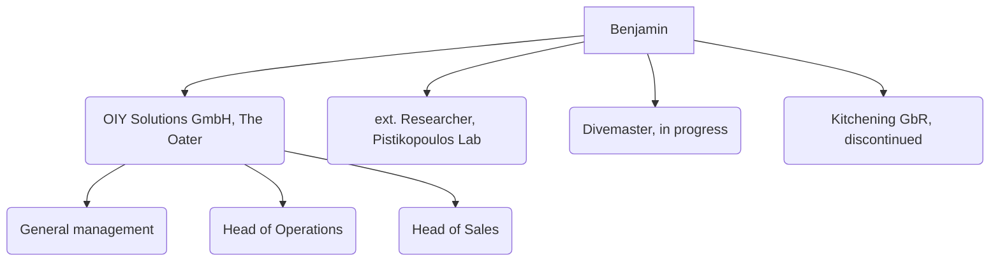

# About me
{: .no_toc }

## Table of contents
{: .no_toc .text-delta }

1. TOC
{:toc}

## Who is that guy?

Hello there! I am Benjamin Auer, founder and currenlty COO of [The Oater](https://www.oater.de).
My work at The Oater is centerd around just-in-time supply chains for perishable and dangerous goods.
I also do sales and coordinate the research and IP generation projects that The Oater is involved in.
At The Oater we make it fresh by moving the place of production to the place of consumption through just-in-time production in our table-top micro-factories.
We use true chemical plant design and apply downsizing, strong food safety measures making sure that our micro-factories may even be operated by untrained personal.
To tackle this challenge, I have to make use of my background in process systems engineering (PSE).
PSE is concerned with the optimal operation of chemical systems, applying mathematical modeling and optimization techniques.
My training started at RWTH Aachen, where I worked for Professor Alexander Mitsos.
Towards the end of my studies I had the great honor to work at [Pistikopoulos Lab](https://parametric.tamu.edu/) at Texas A&M Unviversity for Professor Stratos Pistikopoulos.
When not working, I am traveling the world. Or, I am diving or making pastry.

## Acknowledgments
Dustin Kenefake inspired me to build this page. Dustin works as a postdoctoral researcher at the University of Delaware.
Make sure to have a look at his amazing [projects](https://dkenefake.github.io/).
I am deeply grateful to Marcello Di Martino, who not only encouraged me to pursue my first scientific publication but also sparked my passion for sharing my knowledge. For several of the articles presented here, he generously served as reviewer, mentor and critical voice.
Find some of Marcello's projects [here](https://scholar.google.com/citations?user=ummEBeUAAAAJ&hl=en). More than anything, I am grateful to call Dustin and Marcello great friends.

## Affiliations
{: .d-inline-block }
01-19-2026
{: .label .label-green }

```mermaid
graph TD;	
    Benjamin-->A(OIY Solutions GmbH, The Oater);
    A-->E(General management);
    A-->F(Head of Operations);
    A-->G(Head of Sales);
    Benjamin-->B(ext. Researcher, Pistikopoulos Lab);
    Benjamin-->C(Divemaster, in progress);
	Benjamin-->D(Kitchening GbR, discontinued);
```
